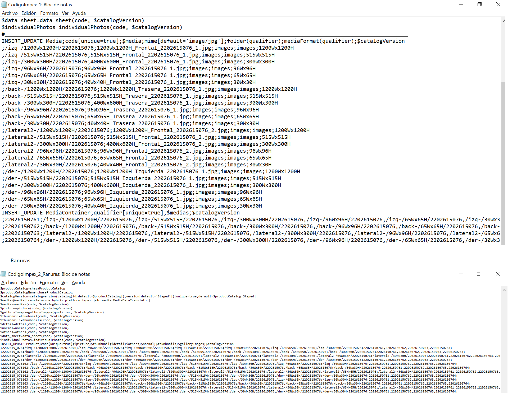

```{r setup, include=FALSE}
knitr::opts_chunk$set(echo = TRUE)
```

 
# Genaración código IMPEX 

El propósito del presente programa es la creación de las herramientas necesarias para subir a la plataforma BackOffice(SAP) una carpeta que contiene imagenes de productos (.jpg) con distintas dimensiones, el nombre de estas esta compuesto por su tamaño, sku(10 digitos) y vista (Frontal, Izquierda, Derecha y/o Trasera). 

Para realizar el proceso anterior, es necesario que los archivos seleccionados sean los correctos, por lo tanto el programa también incluye un proceso de validación. 

Como input recibe la carpeta en donde se encuentran las imagenes, la carpeta en donde se colocarán los resultados y un cubo en donde se encuentran todas las tallas (variante, color, talla) 


El archivo Ejecutable.R une todos los procesos, estos se describen a continuación: 

### RAW 

Se realiza un primer filtro con uso de metadatos: 

* Archivos erroneos
* Archivos con extensión incorrecta (no es .jpg)

### VerificandoErroresEtiqueta

* Cuando el resaizing no detecta la vista del archivo coloca la etiqueta 'Error', en este script se mueven todas estas imagenes a un nuevo directorio.

### VerificandoString

* SKU no númerico 
* El nombre de las imagenes terminen en ".jpg"
* Las vistas deben de ser Izquierda, Derecha, Frontal y/o Trasera

### Requerimientos

* Una sola imagen con todas las dimensiones ("1200Wx1200H", "515Wx515H", "400Wx600H", "300Wx300H" ,"96Wx96H", "65Wx65H","40Wx40H", "30Wx30H")

### GeneracionTallas

* Se detecta si el sku de todas las fotos se encuntran en cubo
* Aquí mismo se imprime el reporte de si es que existen reportes. 

### ItemsUnicosFamilia

* Se genera una carpeta de imagenes "inecesarias" son imagenes con tamaños que no aparecen en el codigo impex pero es necesario subirlo. 
* Posteriormente se detecta si un producto es unico o tiene familia(Es el mismo producto pero con diferentes colores)

### CodigoItemsUnicos

* Creacion código IMPEX contiene una estructura para productos que no tienen familia, por ejemplo: 



### CodigoItemsFamilia


### Ultimos detalles

Se regresan las imagenes innecesarias(los tamaños que no se ven reflejados en IMPEX) a la carpeta origen para que todo lo que se necesite subir quede en un solo lugar y se procede a enviar todo eso a un archivo Zip, este a su vez es enviado a una carpeta de resultados, si la carpeta de errores esta vacia se elimina. 

### Lotes

Si todo el proceso viene de un archivo mayor al requerimiento (32 megas) se dividen la carpeta de imagenes para que Back Office lo pueda soportar. 

### Impresion 

Finalmente en este script, si todo el procedimiento fue existoso, se muestra un mensaje para el usuario y los impex generados se crean en formato txt, además de un reporte que menciona que items son los que se le creó el impex. 


## Reetiquetado


Este programa esta pensado para realizar un reetiquetado si se encuentra una imagen que contenga la palabra Error en su etiqueta, consta de dos archivos, el primero es .ipynb, ahí se explica con claridad que es lo que se realiza en cada seccion. El archivo Ejecutable_Reetiquetado.py es la versión que esta pensada para ejecutar desde consola. 

